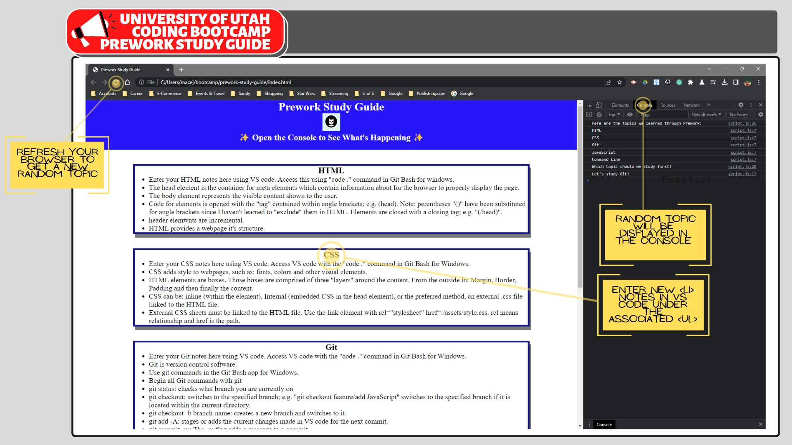

# Prework Study Guide

## A single page study guide with beginner topics covered in the Ed-Ex 2022 web development boot camp.

This guide was created for students of the edX Full Stack Web Development Coding Boot Camp, as a prework introductiom to Markdown, HTML, CSS, Git, GitHub and JavaScript. 

## Installation
N/A The guide is browser based only. 

## How to use:

The guide can be used as a notebook the user can add to or modify in the associated language. Using the guide in each of the languages will immerse the user in the development ecosystem. Although it's rudimentary, the repetition will familiarize users with basic dev tools and introduce basic programming concepts and syntax. 

## Credits

N/A

## License
MIT 
Please refer to the license in the repo.
